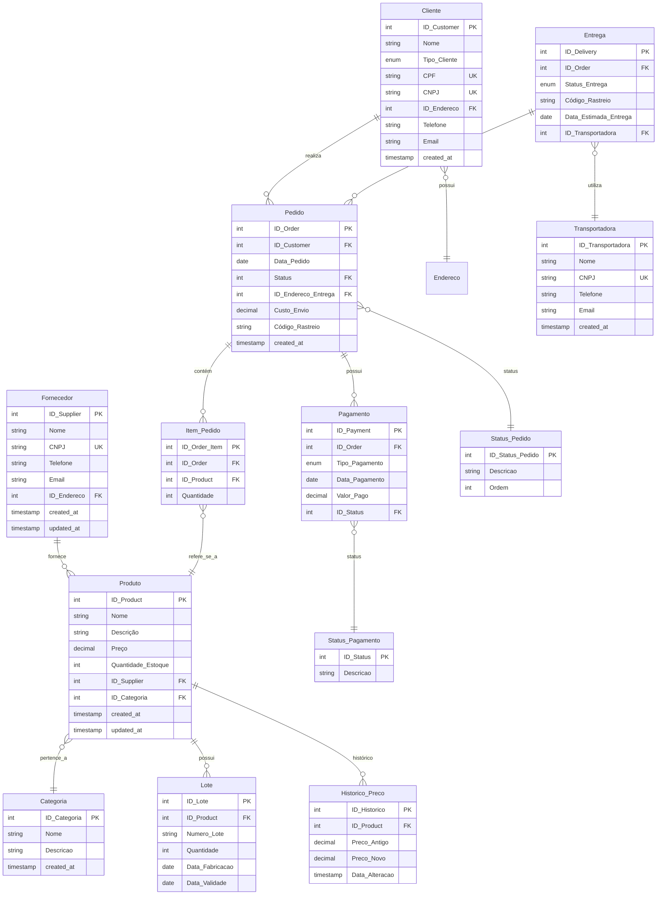

# 🗂️ Order Management Database Model – Refinement & UML Diagram

<p align="center">
  
  
  
  
</p>

---

This repository presents a **refined database model for order management**. The structure includes well-defined entities such as **Product, Supplier, Customer, and Order**, along with the following new enhancements:

- Support for two customer types: `PF` (individual) and `PJ` (legal entity)
- Multiple payment methods per order
- Delivery tracking and status management
- Designed normalization and improved reference integrity

The project scope covers **database model refinement and UML diagram construction only**. The solution provides a clear, extensible basis for future system development, ensuring data consistency and facilitating visualization for stakeholders.

---

## 🔎 Main Improvements and Refinements

1. **Address Normalization**: Addresses are stored in a single table (`Endereco`), referenced by customers, suppliers, and orders.
2. **Product Categorization**: Products are associated with categories, enabling segmentation and more efficient queries.
3. **Price History**: Complete audit trail for product price changes.
4. **Granular Payment/Order Status**: Specialized tables for statuses and custom workflow ordering.
5. **Temporal Auditing**: `created_at`/`updated_at` fields in all main tables, with history triggers.
6. **Advanced Email/Phone Validation**: Using native SQL constraints to ensure integrity.
7. **Batch and Validity Control**: Full control over batch numbers, manufacturing, and expiration dates.
8. **Specialized Carrier**: Deliveries can now be linked to registered carriers.
9. **Composite Indexes**: For improved performance in key queries.
10. **Advanced Reporting and Queries**: New examples for extracting operational insights.

---

## 🗂️ Entities and Attributes

<details>
<summary><strong>Endereco</strong></summary>

- `ID_Endereco` (chave primária)
- CEP
- Logradouro
- Número
- Complemento
- Bairro
- Cidade
- Estado
- created_at
</details>

<details>
<summary><strong>Categoria</strong></summary>

- `ID_Categoria` (chave primária)
- Nome
- Descricao
- created_at
</details>

<details>
<summary><strong>Fornecedor</strong></summary>

- `ID_Supplier` (chave primária)
- Nome
- CNPJ (único)
- `ID_Endereco` (chave estrangeira)
- Telefone
- Email
- created_at
- updated_at
</details>

<details>
<summary><strong>Produto</strong></summary>

- `ID_Product` (chave primária)
- Nome
- Descricao
- Preco
- Quantidade_Estoque
- `ID_Supplier` (chave estrangeira)
- `ID_Categoria` (chave estrangeira)
- created_at
- updated_at
</details>

<details>
<summary><strong>Lote</strong></summary>

- `ID_Lote` (chave primária)
- `ID_Product` (chave estrangeira)
- Numero_Lote
- Quantidade
- Data_Fabricacao
- Data_Validade
</details>

<details>
<summary><strong>Cliente</strong></summary>

- `ID_Customer` (chave primária)
- Nome
- Tipo_Cliente (enum: 'PF', 'PJ')
- CPF (obrigatório se PF)
- CNPJ (obrigatório se PJ)
- `ID_Endereco` (chave estrangeira)
- Telefone (com validação)
- Email (com validação)
- created_at
</details>

<details>
<summary><strong>Pedido</strong></summary>

- `ID_Order` (chave primária)
- `ID_Customer` (chave estrangeira)
- Data_Pedido
- Status (`ID_Status_Pedido` referência)
- `ID_Endereco_Entrega` (chave estrangeira)
- Custo_Envio
- Código_Rastreio
- created_at
</details>

<details>
<summary><strong>Item_Pedido</strong></summary>

- `ID_Order_Item` (chave primária)
- `ID_Order` (chave estrangeira)
- `ID_Product` (chave estrangeira)
- Quantidade
</details>

<details>
<summary><strong>Pagamento</strong></summary>

- `ID_Payment` (chave primária)
- `ID_Order` (chave estrangeira)
- Tipo_Pagamento (Cartão, Boleto, Transferência)
- Data_Pagamento
- Valor_Pago
- Status (`ID_Status` referência)
</details>

<details>
<summary><strong>Status_Pedido</strong></summary>

- `ID_Status_Pedido` (chave primária)
- Descricao
- Ordem
</details>

<details>
<summary><strong>Status_Pagamento</strong></summary>

- `ID_Status` (chave primária)
- Descricao
</details>

<details>
<summary><strong>Entrega</strong></summary>

- `ID_Delivery` (chave primária)
- `ID_Order` (chave estrangeira)
- Status_Entrega (Pendente, Em Trânsito, Entregue)
- Código_Rastreio
- Data_Estimada_Entrega
- `ID_Transportadora` (chave estrangeira)
</details>

<details>
<summary><strong>Transportadora</strong></summary>

- `ID_Transportadora` (chave primária)
- Nome
- CNPJ (único)
- Telefone
- Email
- created_at
</details>

<details>
<summary><strong>Historico_Preco</strong></summary>

- `ID_Historico` (chave primária)
- `ID_Product` (chave estrangeira)
- Preco_Antigo
- Preco_Novo
- Data_Alteracao
</details>

---

## 🔗 Relationships

- **Fornecedor → Produto** (1:N)
- **Fornecedor → Endereco** (1:1)
- **Produto → Categoria** (N:1)
- **Produto → Lote** (1:N)
- **Produto → Historico_Preco** (1:N)
- **Cliente → Pedido** (1:N)
- **Cliente → Endereco** (1:1)
- **Pedido → Item_Pedido** (1:N)
- **Pedido → Status_Pedido** (N:1)
- **Pedido → Pagamento** (1:N)
- **Pagamento → Status_Pagamento** (N:1)
- **Entrega → Transportadora** (N:1)
- **Entrega → Pedido** (N:1)
- **Produto → Item_Pedido** (N:1)

---

## 🧠 Diagram ER/UML



---

## 🛠️ Data Bank Script (MySQL 8+)

```sql
-- ============================================
--            REFERENCE TABLES
-- ============================================
CREATE TABLE Endereco (
    ID_Endereco INT PRIMARY KEY AUTO_INCREMENT,
    CEP CHAR(8) NOT NULL,
    Logradouro VARCHAR(150) NOT NULL,
    Numero VARCHAR(10),
    Complemento VARCHAR(100),
    Bairro VARCHAR(100) NOT NULL,
    Cidade VARCHAR(100) NOT NULL,
    Estado CHAR(2) NOT NULL,
    created_at TIMESTAMP DEFAULT CURRENT_TIMESTAMP
);

CREATE TABLE Categoria (
    ID_Categoria INT PRIMARY KEY AUTO_INCREMENT,
    Nome VARCHAR(100) NOT NULL,
    Descricao TEXT,
    created_at TIMESTAMP DEFAULT CURRENT_TIMESTAMP
);

CREATE TABLE Status_Pedido (
    ID_Status_Pedido INT PRIMARY KEY AUTO_INCREMENT,
    Descricao VARCHAR(50) NOT NULL UNIQUE,
    Ordem INT NOT NULL
);

CREATE TABLE Status_Pagamento (
    ID_Status INT PRIMARY KEY AUTO_INCREMENT,
    Descricao VARCHAR(50) NOT NULL UNIQUE
);

CREATE TABLE Transportadora (
    ID_Transportadora INT PRIMARY KEY AUTO_INCREMENT,
    Nome VARCHAR(100) NOT NULL,
    CNPJ CHAR(14) UNIQUE,
    Telefone VARCHAR(15),
    Email VARCHAR(100),
    created_at TIMESTAMP DEFAULT CURRENT_TIMESTAMP
);

-- ============================================
--             MAIN TABLES
-- ============================================
CREATE TABLE Fornecedor (
    ID_Supplier INT PRIMARY KEY AUTO_INCREMENT,
    Nome VARCHAR(100) NOT NULL,
    CNPJ CHAR(14) NOT NULL UNIQUE,
    ID_Endereco INT,
    Telefone VARCHAR(15),
    Email VARCHAR(100),
    created_at TIMESTAMP DEFAULT CURRENT_TIMESTAMP,
    updated_at TIMESTAMP DEFAULT CURRENT_TIMESTAMP ON UPDATE CURRENT_TIMESTAMP,
    FOREIGN KEY (ID_Endereco) REFERENCES Endereco(ID_Endereco)
);

CREATE TABLE Produto (
    ID_Product INT PRIMARY KEY AUTO_INCREMENT,
    Nome VARCHAR(100) NOT NULL,
    Descricao TEXT,
    Preco DECIMAL(10,2) NOT NULL,
    Quantidade_Estoque INT NOT NULL DEFAULT 0,
    ID_Supplier INT NOT NULL,
    ID_Categoria INT,
    created_at TIMESTAMP DEFAULT CURRENT_TIMESTAMP,
    updated_at TIMESTAMP DEFAULT CURRENT_TIMESTAMP ON UPDATE CURRENT_TIMESTAMP,
    FOREIGN KEY (ID_Supplier) REFERENCES Fornecedor(ID_Supplier),
    FOREIGN KEY (ID_Categoria) REFERENCES Categoria(ID_Categoria)
);

CREATE TABLE Cliente (
    ID_Customer INT PRIMARY KEY AUTO_INCREMENT,
    Nome VARCHAR(100) NOT NULL,
    Tipo_Cliente ENUM('PF', 'PJ') NOT NULL,
    CPF CHAR(11) UNIQUE,
    CNPJ CHAR(14) UNIQUE,
    ID_Endereco INT,
    Telefone VARCHAR(15),
    Email VARCHAR(100),
    created_at TIMESTAMP DEFAULT CURRENT_TIMESTAMP,
    CONSTRAINT chk_tipo_documento CHECK (
        (Tipo_Cliente = 'PF' AND CPF IS NOT NULL AND CNPJ IS NULL) OR
        (Tipo_Cliente = 'PJ' AND CNPJ IS NOT NULL AND CPF IS NULL)
    ),
    CONSTRAINT chk_email CHECK (
        Email REGEXP '^[A-Za-z0-9._%+-]+@[A-Za-z0-9.-]+\\.[A-Za-z]{2,}$'
    ),
    CONSTRAINT chk_telefone CHECK (
        Telefone REGEXP '^[1-9]{2}[0-9]{8,9}$'
    ),
    FOREIGN KEY (ID_Endereco) REFERENCES Endereco(ID_Endereco)
);

CREATE TABLE Pedido (
    ID_Order INT PRIMARY KEY AUTO_INCREMENT,
    ID_Customer INT NOT NULL,
    Data_Pedido DATE NOT NULL,
    Status INT NOT NULL, -- Chave para Status_Pedido
    ID_Endereco_Entrega INT,
    Custo_Envio DECIMAL(10,2) DEFAULT 0,
    Código_Rastreio VARCHAR(50),
    created_at TIMESTAMP DEFAULT CURRENT_TIMESTAMP,
    FOREIGN KEY (ID_Customer) REFERENCES Cliente(ID_Customer),
    FOREIGN KEY (Status) REFERENCES Status_Pedido(ID_Status_Pedido),
    FOREIGN KEY (ID_Endereco_Entrega) REFERENCES Endereco(ID_Endereco)
);

CREATE TABLE Item_Pedido (
    ID_Order_Item INT PRIMARY KEY AUTO_INCREMENT,
    ID_Order INT NOT NULL,
    ID_Product INT NOT NULL,
    Quantidade INT NOT NULL,
    FOREIGN KEY (ID_Order) REFERENCES Pedido(ID_Order),
    FOREIGN KEY (ID_Product) REFERENCES Produto(ID_Product)
);

CREATE TABLE Pagamento (
    ID_Payment INT PRIMARY KEY AUTO_INCREMENT,
    ID_Order INT NOT NULL,
    Tipo_Pagamento ENUM('Cartão', 'Boleto', 'Transferência'),
    Data_Pagamento DATE,
    Valor_Pago DECIMAL(10,2),
    ID_Status INT DEFAULT 1,
    FOREIGN KEY (ID_Order) REFERENCES Pedido(ID_Order),
    FOREIGN KEY (ID_Status) REFERENCES Status_Pagamento(ID_Status)
);

CREATE TABLE Entrega (
    ID_Delivery INT PRIMARY KEY AUTO_INCREMENT,
    ID_Order INT NOT NULL,
    Status_Entrega ENUM('Pendente', 'Em Trânsito', 'Entregue'),
    Código_Rastreio VARCHAR(50),
    Data_Estimada_Entrega DATE,
    ID_Transportadora INT,
    FOREIGN KEY (ID_Order) REFERENCES Pedido(ID_Order),
    FOREIGN KEY (ID_Transportadora) REFERENCES Transportadora(ID_Transportadora)
);

CREATE TABLE Lote (
    ID_Lote INT PRIMARY KEY AUTO_INCREMENT,
    ID_Product INT NOT NULL,
    Numero_Lote VARCHAR(50) NOT NULL,
    Quantidade INT NOT NULL,
    Data_Fabricacao DATE,
    Data_Validade DATE,
    FOREIGN KEY (ID_Product) REFERENCES Produto(ID_Product)
);

CREATE TABLE Historico_Preco (
    ID_Historico INT PRIMARY KEY AUTO_INCREMENT,
    ID_Product INT NOT NULL,
    Preco_Antigo DECIMAL(10,2),
    Preco_Novo DECIMAL(10,2) NOT NULL,
    Data_Alteracao TIMESTAMP DEFAULT CURRENT_TIMESTAMP,
    FOREIGN KEY (ID_Product) REFERENCES Produto(ID_Product)
);

-- ============================================
--    ORDER STATUS/TYPES AND PAYMENT (DATA)
-- ============================================
INSERT INTO Status_Pedido (Descricao, Ordem) VALUES
('Novo', 1), ('Em Processamento', 2), ('Aguardando Pagamento', 3),
('Pago', 4), ('Preparando Envio', 5), ('Enviado', 6),
('Em Trânsito', 7), ('Entregue', 8), ('Cancelado', 9);

INSERT INTO Status_Pagamento (Descricao) VALUES 
('Pendente'), ('Pago'), ('Estornado'), ('Cancelado'), ('Em Processamento');

-- ============================================
--             OPTIMIZED INDEXES
-- ============================================
CREATE INDEX idx_pedido_status_data ON Pedido(Status, Data_Pedido);
CREATE INDEX idx_produto_categoria ON Produto(ID_Categoria, Preco);
CREATE INDEX idx_item_pedido_completo ON Item_Pedido(ID_Order, ID_Product);
CREATE INDEX idx_cliente_tipo ON Cliente(Tipo_Cliente, created_at);

-- ============================================
--          PRODUCT CHANGE AUDIT
-- ============================================
DELIMITER //
CREATE TRIGGER trg_audita_preco_produto
AFTER UPDATE ON Produto
FOR EACH ROW
BEGIN
    IF OLD.Preco <> NEW.Preco THEN
        INSERT INTO Historico_Preco (ID_Product, Preco_Antigo, Preco_Novo)
        VALUES (NEW.ID_Product, OLD.Preco, NEW.Preco);
    END IF;
END;
//
DELIMITER ;

-- ============================================
--               TEST INSERTS
-- ============================================
INSERT INTO Fornecedor (Nome, CNPJ, Telefone, Email) VALUES
('Fornecedor Alpha', '12345678000195', '11987654321', 'alpha@email.com'),
('Fornecedor Beta', '98765432000188', '11987654322', 'beta@email.com');

INSERT INTO Categoria (Nome, Descricao) VALUES
('Eletrônicos', 'Produtos eletrônicos diversos'),
('Alimentos', 'Produtos alimentícios');

-- ... demais inserts conforme entidades ...
```

---

## 📊 Consultas Avançadas

```sql
-- 1. Price change history
SELECT 
    P.Nome AS Produto,
    HP.Preco_Antigo,
    HP.Preco_Novo,
    HP.Data_Alteracao
FROM Historico_Preco HP
JOIN Produto P ON HP.ID_Product = P.ID_Product
ORDER BY HP.Data_Alteracao DESC;

-- 2. Products by category with critical stock levels
SELECT 
    C.Nome AS Categoria,
    P.Nome AS Produto,
    P.Quantidade_Estoque,
    CASE 
        WHEN P.Quantidade_Estoque < 10 THEN 'CRÍTICO'
        WHEN P.Quantidade_Estoque < 50 THEN 'BAIXO'
        ELSE 'NORMAL'
    END AS Status_Estoque
FROM Produto P
JOIN Categoria C ON P.ID_Categoria = C.ID_Categoria
WHERE P.Quantidade_Estoque < 50
ORDER BY P.Quantidade_Estoque ASC;

-- 3. Sales analysis by period and category.
SELECT 
    DATE_FORMAT(Pe.Data_Pedido, '%Y-%m') AS Mes,
    C.Nome AS Categoria,
    COUNT(DISTINCT Pe.ID_Order) AS Total_Pedidos,
    SUM(I.Quantidade) AS Quantidade_Vendida,
    SUM(I.Quantidade * P.Preco) AS Valor_Total
FROM Pedido Pe
JOIN Item_Pedido I ON Pe.ID_Order = I.ID_Order
JOIN Produto P ON I.ID_Product = P.ID_Product
JOIN Categoria C ON P.ID_Categoria = C.ID_Categoria
WHERE Pe.Data_Pedido >= DATE_SUB(CURDATE(), INTERVAL 6 MONTH)
GROUP BY Mes, C.Nome
ORDER BY Mes DESC, Valor_Total DESC;

-- 4. Transport companies with the best performance
SELECT 
    T.Nome AS Transportadora,
    COUNT(E.ID_Delivery) AS Total_Entregas,
    AVG(DATEDIFF(E.Data_Entrega_Real, Pe.Data_Pedido)) AS Dias_Medios,
    SUM(CASE WHEN E.Status_Entrega = 'Entregue' THEN 1 ELSE 0 END) / COUNT(*) * 100 AS Taxa_Sucesso
FROM Entrega E
JOIN Transportadora T ON E.ID_Transportadora = T.ID_Transportadora
JOIN Pedido Pe ON E.ID_Order = Pe.ID_Order
GROUP BY T.ID_Transportadora
HAVING COUNT(E.ID_Delivery) >= 5
ORDER BY Taxa_Sucesso DESC;
```

---

## 🚀 Technologies Used

- **Database:** MySQL 8+ ou PostgreSQL 14+
- **Modeling:** Mermaid, MySQL Workbench, pgAdmin
- **Version control:** Git

---

## 📦 Installation and Execution

```bash
git clone https://github.com/seu-usuario/order-management-system.git
cd order-management-system
mysql -u root -p < database/schema.sql
mysql -u root -p < database/seed.sql
mysql -u root -p < database/queries.sql
```

---

## ✅ Testing and Validation

- Insira itens em estoque menor que o disponível e verifique o manejo.
- Valide constraints de CPF/CNPJ, e o correto vínculo de endereços.
- Teste validação de email e telefone (MySQL 8+).
- Simule alteração de preço e verifique entradas em `Historico_Preco`.
- Teste consultas para garantir relacionamentos funcionais.
- Valide integridade ao excluir clientes com pedidos vinculados.

---

## 📄 License

Licensed under the [MIT License](LICENSE).

---

<p align="center">
  <a href="https://www.linkedin.com/in/pedrosolozabal/">
    
  </a>
</p>
