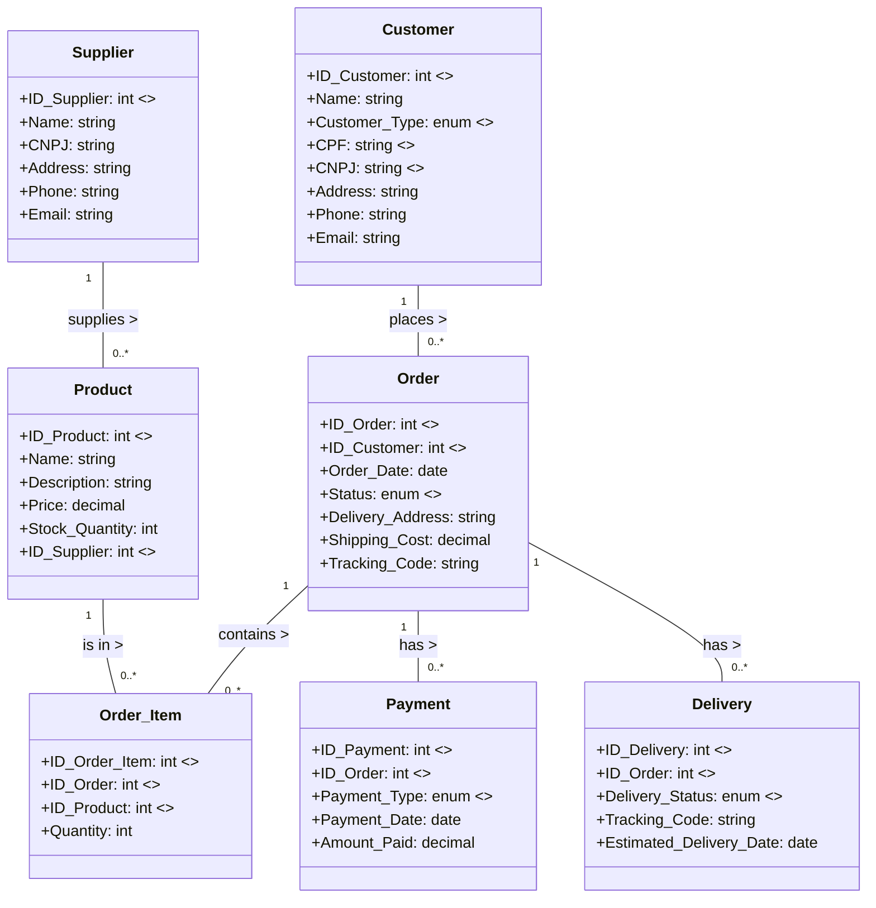

# Order Management System

This project is an order management system that allows you to manage products, suppliers, customers, orders, order items, payments, and deliveries.

## Entities and Attributes

### Product
- **ID_Product** (primary key)
- **Name**
- **Description**
- **Price**
- **Stock_Quantity**
- **ID_Supplier** (foreign key, referencing Supplier)

### Supplier
- **ID_Supplier** (primary key)
- **Name**
- **CNPJ**
- **Address**
- **Phone**
- **Email**

### Customer
- **ID_Customer** (primary key)
- **Name**
- **Customer_Type** (enum: 'PF' - Pessoa Física, 'PJ' - Pessoa Jurídica) // Identifies if the customer is an individual or a company
- **CPF** (unique field, required if Customer_Type = 'PF')
- **CNPJ** (unique field, required if Customer_Type = 'PJ')
- **Address**
- **Phone**
- **Email**

### Order
- **ID_Order** (primary key)
- **ID_Customer** (foreign key, referencing Customer)
- **Order_Date**
- **Status** (e.g., Pending, Shipped, Canceled)
- **Delivery_Address**
- **Shipping_Cost**
- **Delivery_Status** (e.g., Pending, In Transit, Delivered)
- **Tracking_Code**

### Order_Item
- **ID_Order_Item** (primary key)
- **ID_Order** (foreign key, referencing Order)
- **ID_Product** (foreign key, referencing Product)
- **Quantity**

### Payment
- **ID_Payment** (primary key)
- **ID_Order** (foreign key, referencing Order)
- **Payment_Type** (e.g., Credit Card, Boleto, Transfer)
- **Payment_Date**
- **Amount_Paid**

### Delivery (optional)
- **ID_Delivery** (primary key)
- **ID_Order** (foreign key, referencing Order)
- **Delivery_Status** (e.g., Pending, In Transit, Delivered)
- **Tracking_Code**
- **Estimated_Delivery_Date**

## Relationships
- A supplier can supply many products; each product is supplied by only one supplier (one-to-many).
- A customer can place multiple orders (one-to-many).
- An order can contain multiple products; a product can be in multiple orders (many-to-many).
- An order can have multiple associated payment methods.
- Each order can have one or more associated deliveries.

## UML Diagram

# Database Schema

## Creating the Supplier table
CREATE TABLE Supplier (
    ID_Supplier INT PRIMARY KEY AUTO_INCREMENT,
    Name VARCHAR(100) NOT NULL,
    CNPJ CHAR(14) NOT NULL UNIQUE,
    Address VARCHAR(255),
    Phone VARCHAR(15),
    Email VARCHAR(100)
);

## Creating the Product table
CREATE TABLE Product (
    ID_Product INT PRIMARY KEY AUTO_INCREMENT,
    Name VARCHAR(100) NOT NULL,
    Description TEXT,
    Price DECIMAL(10, 2) NOT NULL,
    Stock_Quantity INT NOT NULL,
    ID_Supplier INT NOT NULL,
    FOREIGN KEY (ID_Supplier) REFERENCES Supplier(ID_Supplier)
);

## Creating the Customer table
CREATE TABLE Customer (
    ID_Customer INT PRIMARY KEY AUTO_INCREMENT,
    Name VARCHAR(100) NOT NULL,
    Customer_Type ENUM('PF', 'PJ') NOT NULL,
    CPF CHAR(11) UNIQUE,
    CNPJ CHAR(14) UNIQUE,
    Address VARCHAR(255),
    Phone VARCHAR(15),
    Email VARCHAR(100),
    CHECK ((Customer_Type = 'PF' AND CPF IS NOT NULL AND CNPJ IS NULL) OR
           (Customer_Type = 'PJ' AND CNPJ IS NOT NULL AND CPF IS NULL))
);

## Creating the Order table
CREATE TABLE Order (
    ID_Order INT PRIMARY KEY AUTO_INCREMENT,
    ID_Customer INT NOT NULL,
    Order_Date DATE NOT NULL,
    Status ENUM('Pending', 'Shipped', 'Canceled') NOT NULL,
    Delivery_Address VARCHAR(255),
    Shipping_Cost DECIMAL(10, 2),
    Tracking_Code VARCHAR(50),
    FOREIGN KEY (ID_Customer) REFERENCES Customer(ID_Customer)
);

## CREATE TABLE Order_Item (
    ID_Order_Item INT PRIMARY KEY AUTO_INCREMENT,
    ID_Order INT NOT NULL,
    ID_Product INT NOT NULL,
    Quantity INT NOT NULL,
    FOREIGN KEY (ID_Order) REFERENCES Order(ID_Order),
    FOREIGN KEY (ID_Product) REFERENCES Product(ID_Product)
);

## CREATE TABLE Payment (
    ID_Payment INT PRIMARY KEY AUTO_INCREMENT,
    ID_Order INT NOT NULL,
    Payment_Type ENUM('Credit Card', 'Boleto', 'Transfer') NOT NULL,
    Payment_Date DATE NOT NULL,
    Amount_Paid DECIMAL(10, 2) NOT NULL,
    FOREIGN KEY (ID_Order) REFERENCES Order(ID_Order)
);

## Creating the Delivery table
CREATE TABLE Delivery (
    ID_Delivery INT PRIMARY KEY AUTO_INCREMENT,
    ID_Order INT NOT NULL,
    Delivery_Status ENUM('Pending', 'In Transit', 'Delivered') NOT NULL,
    Tracking_Code VARCHAR(50),
    Estimated_Delivery_Date DATE,
    FOREIGN KEY (ID_Order) REFERENCES Order(ID_Order)
);

## Inserting test data
INSERT INTO Supplier (Name, CNPJ, Address, Phone, Email)
VALUES
('Supplier A', '12345678000195', 'Street A, 123', '11987654321', 'supplierA@email.com'),
('Supplier B', '98765432000188', 'Street B, 456', '11987654322', 'supplierB@email.com');

INSERT INTO Product (Name, Description, Price, Stock_Quantity, ID_Supplier)
VALUES
('Product 1', 'Description of Product 1', 100.00, 50, 1),
('Product 2', 'Description of Product 2', 150.00, 30, 2);

INSERT INTO Customer (Name, Customer_Type, CPF, Address, Phone, Email, CNPJ)
VALUES
('Customer PF', 'PF', '12345678901', 'Street Customer PF, 123', '11987654323', 'customerPF@email.com', NULL),
('Customer PJ', 'PJ', NULL, 'Street Customer PJ, 456', '11987654324', 'customerPJ@email.com', '09876543000199');

INSERT INTO Order (ID_Customer, Order_Date, Status, Delivery_Address, Shipping_Cost, Tracking_Code)
VALUES
(1, '2024-01-15', 'Pending', 'Street Customer PF, 123', 15.00, 'TRACK1234'),
(2, '2024-01-15', 'Shipped', 'Street Customer PJ, 456', 20.00, 'TRACK5678');

INSERT INTO Order_Item (ID_Order, ID_Product, Quantity)
VALUES
(1, 1, 2),
(2, 2, 1);

INSERT INTO Payment (ID_Order, Payment_Type, Payment_Date, Amount_Paid)
VALUES
(1, 'Credit Card', '2024-01-15', 200.00),
(2, 'Boleto', '2024-01-15', 150.00);

INSERT INTO Delivery (ID_Order, Delivery_Status, Tracking_Code)
VALUES
(1, 'Pending', 'TRACK1234'),
(2, 'In Transit', 'TRACK5678');

## Adding indexes
CREATE INDEX idx_order_customer ON Order(ID_Customer);
CREATE INDEX idx_order_item_product ON Order_Item(ID_Product);

## Creating trigger for stock validation
DELIMITER $$
CREATE TRIGGER trg_check_stock BEFORE INSERT ON Order_Item
FOR EACH ROW
BEGIN
    DECLARE stock_available INT;
    
    SELECT Stock_Quantity INTO stock_available 
    FROM Product 
    WHERE ID_Product = NEW.ID_Product;

    IF stock_available < NEW.Quantity THEN
        SIGNAL SQLSTATE '45000' SET MESSAGE_TEXT = 'Insufficient stock';
    END IF;
END$$
DELIMITER ;

## Complex SQL queries

### How many orders were placed by each customer?
SELECT C.Name AS Customer_Name, COUNT(O.ID_Order) AS Total_Orders
FROM Customer C
JOIN Order O ON C.ID_Customer = O.ID_Customer
GROUP BY C.Name;

### Is any supplier also a customer?
SELECT S.Name AS Supplier 
FROM Supplier S 
JOIN Customer C ON S.CNPJ = C.CNPJ;

### List of products, suppliers, and stock quantities
SELECT P.Name AS Product, S.Name AS Supplier, P.Stock_Quantity
FROM Product P 
JOIN Supplier S ON P.ID_Supplier = S.ID_Supplier;

### List of supplier names and product names
SELECT S.Name AS Supplier, P.Name AS Product 
FROM Supplier S 
JOIN Product P ON S.ID_Supplier = P.ID_Supplier;

### Total order value per customer
SELECT C.Name AS Customer_Name, SUM(OI.Quantity * P.Price) AS Total_Value 
FROM Customer C 
JOIN Order O ON C.ID_Customer = O.ID_Customer 
JOIN Order_Item OI ON O.ID_Order = OI.ID_Order 
JOIN Product P ON OI.ID_Product = P.ID_Product 
GROUP BY C.Name;

### Products with less than 10 units in stock
SELECT Name, Stock_Quantity 
FROM Product 
WHERE Stock_Quantity < 10;

### Overdue orders
SELECT O.ID_Order, O.Order_Date, D.Delivery_Status 
FROM Order O 
JOIN Delivery D ON O.ID_Order = D.ID_Order 
WHERE D.Delivery_Status = 'Pending' AND O.Order_Date < CURDATE();

# Technologies Used
Relational Database: MySQL or PostgreSQL

## Installation Instructions
Install MySQL or PostgreSQL on your machine.
Create a new database.
Run the provided SQL scripts to create tables, insert test data, and create triggers.
Use a database client (e.g., MySQL Workbench, pgAdmin) to execute the complex SQL queries.

## Testing and Execution
To test the database setup, you can use the provided SQL scripts to create tables and insert test data.
Execute the complex SQL queries to verify the data and relationships.
Ensure that the trigger for stock validation works by attempting to insert an order item with a quantity greater than the available stock.